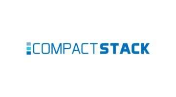

<!-- TABLE OF CONTENTS -->
<details id="contents" >
  <summary>Table of Contents</summary>
  <ol>
    <li>
      <a href="#about-the-project">About The Project</a>
      <ul>
        <li><a href="#our-motivation">Our Motivation</a></li>
        <li><a href="#project-aim">Project Aim</a></li>
      </ul>
    </li>
    <li>
      <a href="#built-with">Built With</a>
      <ul>
        <li><a href="#tech-stack">Tech Stack</a></li>
        <li><a href="#packages-and-libraries-used">Packages Used</a></li>
      </ul>
    </li>
    <li>
      <a href="#getting-started">Getting Started</a>
      <ul>
        <li><a href="#create-the-.env-file">Prerequisites</a></li>
	    <li><a href="#to-start-our-application-locally">Start our App locally</a></li>
        <li><a href="#additional-notes">Additional Notes</a></li>
      </ul>
    </li>
    <li><a href="#acknowledgments">Acknowledgments</a></li>
  </ol>
</details>

<!-- PROJECT LOGO -->
<br />
<div align="center">
  

  <p align="center">
    A summer project on improving SGH's Compactor Management process with technology
  </p>
</div>

<br>

# About the Project
[*__CompactStack__*](https://sgh-compactor-manager-system.herokuapp.com/) is a website that aims to streamline SGH's asset tracking and management process.


Our application covers the most essential features a physiotherapist will need when carrying out their day to day responsibilities of keeping track of their equipment.


## Our Motivation
Without a proper asset-tracking system, daily processes in the physiotherapy department gets messy. The main issue faced by the physiotherapy department in SGH is:

> Physiotherapists are unable to find the equipment they need when it is time for an appointment.

This results in unnecessary time wasted and a potential decline in customer satisfaction.

## Project Aim 
We aim to make asset management easy, by enabling physiotherapists to track, analyse and organise their equipment using devices that are readily available to them, such as their mobile phones.

<p align="right"><<<a href="#contents">back to top</a>>></p>

# Built With

## Tech Stack


* [Mongo DB](https://www.mongodb.com/docs/)
* [Express JS](https://expressjs.com/)
* [React JS/ Redux](https://reactjs.org/)
* [Node JS](https://nodejs.org/en/docs/)

## Packages and Libraries Used
### Frontend (General)
* [react-router-dom](https://v5.reactrouter.com/web/guides/quick-start)
* [react-boostrap](https://react-bootstrap.github.io/components/navbar/)
* [react-router-bootstrap](https://github.com/react-bootstrap/react-router-bootstrap)
* [material-ui](https://mui.com/material-ui/getting-started/overview/)

### Backend
* [Nodemon](https://www.npmjs.com/package/nodemon)

### Dashboard Page 
* [Recharts](https://recharts.org/en-US/guide)

<p align="right"><<<a href="#contents">back to top</a>>></p>

# Getting Started
## Create the .env file
Create your [Google Client ID](https://youtu.be/75aTZq-qoZk?t=376) and add it in a .env file as REACT_APP_GOOGLE_CLIENT_ID in the root folder. Complete the same for the MONGO_URI.
## To start our application locally,
1. Ensure a copy of the .env file in the root directory
1. Open a new Terminal and run the following to setup an API connection with MongoDB

```bash
npm install
npm run serve
```

4. Run the following in a new terminal:
```bash
cd frontend
npm install
```
5. After the packages are installed, setup the frontend react web application by running the following in the same terminal as the previous step.
```bash
npm run start
```

## Additional Notes
* Download VSCode Extension [__REST Client__](https://marketplace.visualstudio.com/items?itemName=humao.rest-client) by Huachao Mao to Test Backend APIs via "Compactor API Testing.rest" and "Logging API Testing.rest"

<p align="right"><<<a href="#contents">back to top</a>>></p>

<!-- ACKNOWLEDGMENTS -->
# Acknowledgments

* [Kwek Zhi Yong Wisely](https://github.com/WiselyKwek)
* [Shaan Walia](https://github.com/mxixqc)
* [Paul Soh Wei Jie](https://github.com/blazefire710)
* [Chen Tianyu](https://github.com/tame12)
* [Yap En Rui Andrea](https://github.com/andreayup)

<p align="right"><<<a href="#contents">back to top</a>>></p>
